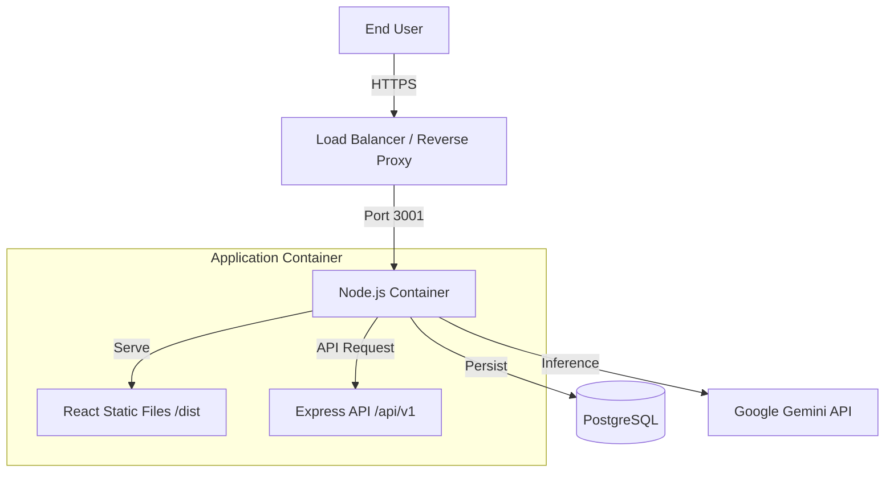

# NJ Foreclosure Finder - Deployment Blueprint

## 1. Architecture Overview

We utilize a **Containerized Monolith** pattern. The React Frontend is built into static assets and served by the Express Backend. This simplifies the deployment topology to a single application container and a database container.



---

## 2. Container Strategy

### The Application Image (`Dockerfile`)
We use a **Multi-Stage Build** to keep the final image light.
1.  **Build Stage:** Installs full dependencies (devDeps), compiles TypeScript backend, and builds React frontend (Vite/Webpack).
2.  **Production Stage:** Copies only the `dist` (backend) and `build` (frontend) folders. Installs only `production` dependencies.

### Orchestration (`docker-compose.yaml`)
Defines the relationship between the App and the Database.
*   **App Service:** Runs the Node process. Injects secrets via Environment Variables.
*   **DB Service:** Standard PostgreSQL 16 image. Persists data to a Docker Volume.

---

## 3. Environment Variables

Create a `.env` file in the root directory before deployment:

```bash
# App Configuration
PORT=3001
NODE_ENV=production
API_KEY=your_google_gemini_api_key

# Database Configuration
POSTGRES_USER=postgres
POSTGRES_PASSWORD=secure_password
POSTGRES_DB=foreclosure_db
DATABASE_URL=postgres://postgres:secure_password@db:5432/foreclosure_db
```

## 4. Operational Commands

**Build and Start:**
```bash
docker-compose up --build -d
```

**View Logs:**
```bash
docker-compose logs -f app
```

**Database Backup:**
```bash
docker-compose exec db pg_dump -U postgres foreclosure_db > backup.sql
```
